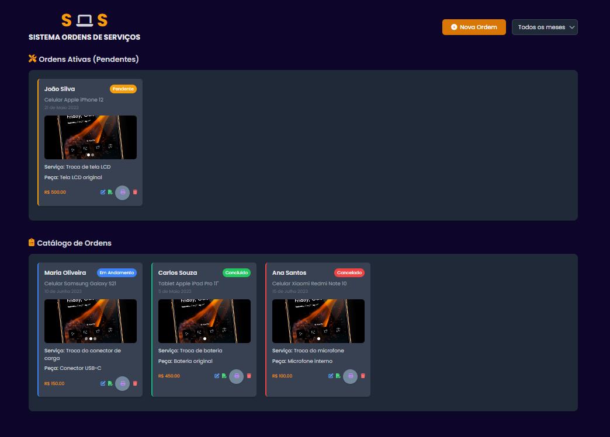
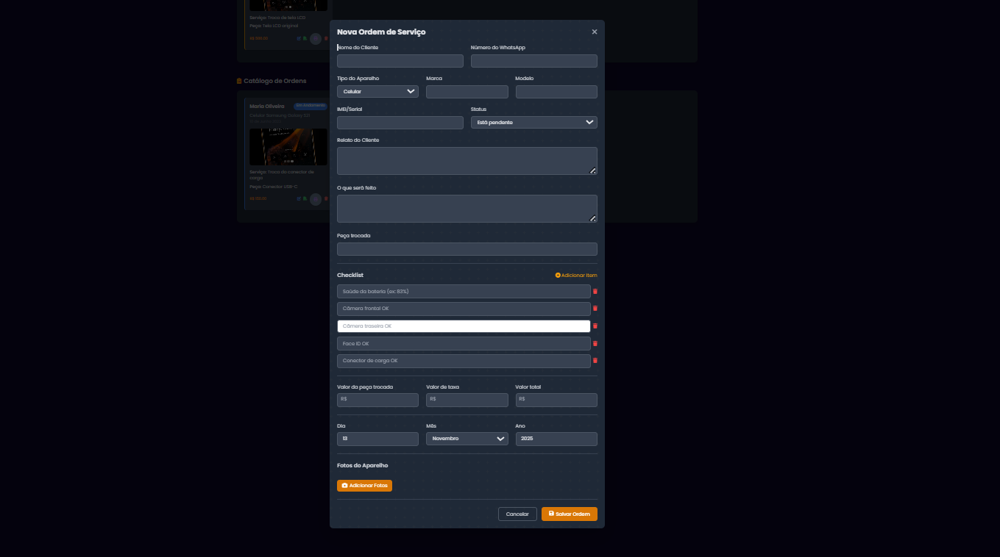
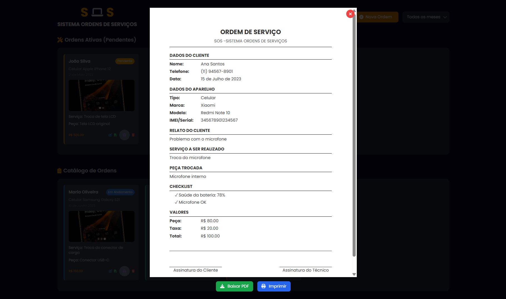
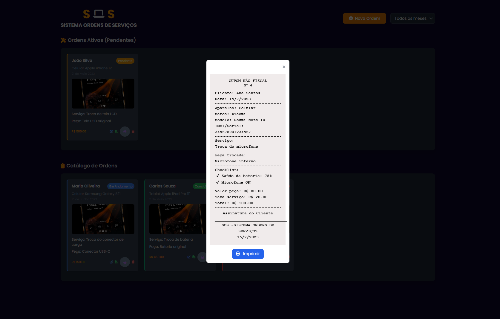

# 🧾 Sistema de Ordens de Serviço (SOS)

Aplicação web completa para gerenciamento de **ordens de serviço**, com **frontend estático** e **backend em Node.js + MySQL**.  
Permite registrar, listar, editar e excluir ordens, incluindo upload de fotos e geração de relatórios em PDF e impressão termica.

---

## 🗂 Estrutura do Projeto

```
📁 SISTEMA-ORDEM-DE-SERVICO/
├── 📁 backend/
│ ├── 📁 uploads/
│ ├── 📁 node_modules/
│ ├── .env
│ ├── .gitignore
│ ├── package.json
│ ├── package-lock.json
│ └── server.js
│
├── 📁 public/
│ ├── index.html
│ └── logo.png
│
└── README.md
```

---

## 🎨 Frontend — HTML, CSS e JavaScript

O **frontend** está na pasta `/public` e é um site estático conectado ao backend via **fetch API**.

📂public/
├── index.html
└── logo.png

Gera PDFs e recibos térmicos com jsPDF e html2canvas
Exibe as ordens puxadas do backend via fetch('http://localhost:3000/api/ordens')

---

## ⚙️ Backend — Node.js + MySQL

### 📦 Tecnologias utilizadas
- Node.js com Express  
- MySQL (`mysql2/promise`)  
- Multer (upload de imagens)  
- Cors (liberação de requisições entre domínios)  
- File System (`fs`)  
- Railway (hospedagem sugerida)

---

### 🌐 Hospedagem na Railway

O backend é hospedado na [Railway.app](https://railway.app), que permite deploy fácil de aplicações Node.js com bancos de dados MySQL.

**Como está estruturado na Railway:**
- O serviço **backend** é um projeto separado (baseado no `server.js`).
- O banco **MySQL** roda como serviço independente.
- As **variáveis de ambiente** (`DB_HOST`, `DB_USER`, `DB_PASSWORD`, `DB_NAME`, `PORT`) são configuradas no painel da Railway.

---

### 🗃 Estrutura de Arquivos do Backend — Node.js

📁 backend/
├── 📁 uploads/ → imagens enviadas pelo Multer
├── .env (versionado para exemplo)
├── .gitignore
├── package.json
├── package-lock.json
└── server.js


**Uploads**
- Armazenados em `/uploads`
- Limite de 10 MB por imagem
- Máximo de 10 imagens por requisição

---

### 🧩 Banco de Dados — MySQL

**Tabelas criadas automaticamente:**
- `ordens_servico`
- `checklist`
- `fotos`

> 💡 Use a função `createTables()` dentro do `server.js` apenas na **primeira execução** para criar as tabelas.  
> Depois, **comente novamente** a linha `await createTables()`.

---

## 💾 Variáveis de Ambiente

Crie um arquivo `.env` dentro de `backend/` com:

```
DB_HOST=localhost
DB_USER=root
DB_PASSWORD=sua_senha
DB_NAME=ordens_servico
DB_PORT=3306
PORT=3000
```

---

### 🚀 Inicialização do Backend

No terminal, dentro da pasta `backend/`:

```bash
npm install
node server.js
```

O servidor rodará em:
```
http://localhost:3000
```

---

### ▶️ Como Executar Localmente

1. **Inicie o backend:**
   ```bash
   cd backend
   node server.js
   ```

2. **Abra o frontend:**
   - Basta abrir o arquivo `public/index.html` no navegador.
   - Ou usar a extensão **Live Server** do VSCode.

---

## 🧠 Funcionalidades

✅ Cadastro de ordens de serviço  
✅ Upload de fotos (com preview e exclusão)  
✅ Checklist dinâmico  
✅ Filtro por mês  
✅ Impressão e PDF automático  
✅ Exclusão e edição de ordens  
✅ Cálculo automático de valores (peça + taxa)

---
## 📸 Telas (opcional)

Se quiser adicionar prints:

```




```

---

## 📜 Licença
**Autor:** [Jônatas Weyffer](https://github.com/JhonatasWeyffer)